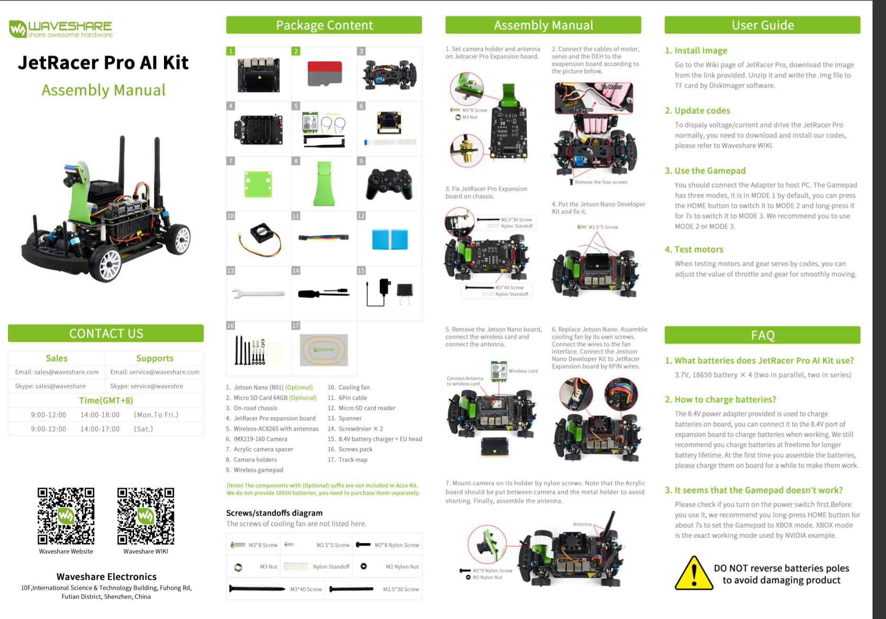
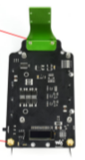
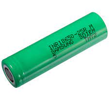

# Car Assembly

**Assembling the Jetson Car**

_Original Manual_

<figure><figcaption></figcaption></figure>

Procedure (Further Explained):

1. Attaching the camera mount.
   1. Use 2 M3\*8 screws
   2. Use 2 M3 nuts
   3. Position camera mount at front of board

<figure><figcaption></figcaption></figure>

For each of the two screws, hold the nut in place while using a Phillips head screwdriver to tighten the screw

<figure><figcaption></figcaption></figure>

2. Attaching batteries
   1. Use the 4 rechargeable batteries
   2. Both ends of the battery are flat, but the positive end has a smaller contact surface than the negative side

_Note: Be sure to double-check that the correct orientation is used_

3. Remove the screws in preparation for attaching the expansion board
   1. Unscrew the two front and two back chassis screws

<figure><figcaption></figcaption></figure>

Put these screws in a bag or secure place in case they are needed later

4. Attach chassis wires to expansion board
   1. Find the two sets of black, white, and red wires
   2. Identify the connections on the under side of the expansion board left of where the camera is mounted
   3. Wire from the lower part of the chassis connects to the port closer to the battery
   4. Wire from the upper part of the chassis connects to the port further away from the battery
   5. Both wires connect with the white wire on the inside of the board

<figure><figcaption></figcaption></figure>

5. Attach red motor power wire
   1. Identify the red wire with a yellow tag attached to the chassis (this is the only other wire left to plug in)
   2. This wire plugs into the port beneath the back left of the expansion board

6. Attach JetRacer expansion board to car chassis
   1. Use two M2.5\*30 screws for the front
   2. Use two M3\*40 screws for the back

<figure><figcaption></figcaption></figure>

Use four nylon standoffs to fill the gap between the chassis and the board at each of the four holes

<figure><figcaption></figcaption></figure>

&#x20; Rest the expansion board on top of the chassis

While holding the standoffs in place between the chassis and the board, tighten the screws ensuring that the end of the screw reaches all the way down through the standoff to the hole in the chassiS.&#x20;

_Note: tighten each screw loosely at first, then tighten all screws_

7. Attach the Jetson Nano to the expansion board
   1. Use 4 M2.5\*5 screws
   2. Place Jetson Nano on top of expansion board and line up with four holes
   3. Insert and tighten the screws

<figure><figcaption></figcaption></figure>

8. Insert wireless card and connect to antenna
   1. Remove the Jetson Nano board
   2. Insert wireless card into slot
   3. Replace Jetson Nano board when done

<figure><figcaption></figcaption></figure>

9. Attach cooling fan
   1. Screw fan onto the top of the Jetson Nano board
   2. Connect wires to fan interface
   3. Connect the Jetson Nano to the JetRacer expansion board using the 6PIN wires

<figure><figcaption></figcaption></figure>

10. Mount the camera
    1. Use the green Acrylic board
    2. Use 4 M2\*8 screws
    3. Use 4 M2 nuts
    4. Secure the Acrylic board in between the camera and the mount

<figure><figcaption></figcaption></figure>

While holding the nuts, tighten the screws until the camera is securely fastened

11. Assemble the Antenna
    1. Screw the two wifi antennas into their ports in the back of the car

<figure><figcaption></figcaption></figure>
